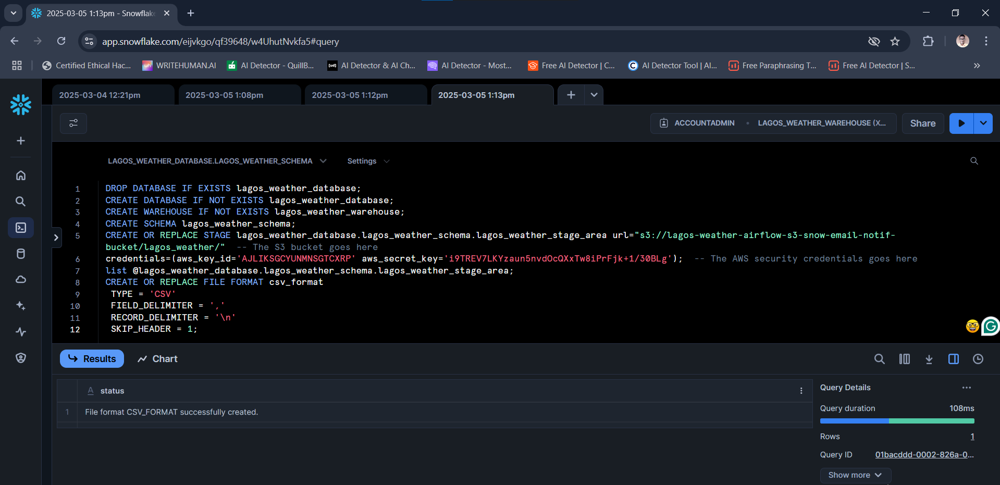

# OpenWeatherMap API to S3 bucket to Snowflake ETL Pipeline by Airflow on EC2 with email notification
This is my first ever industry-level AWS Cloud Data Engineering ETL project. This data pipeline orchestration uses Apache Airflow on AWS EC2. 

It demonstrates how to build an ETL data pipeline that would extract data (JSON) from the OpenWeatherMap API, transform it, dump it as CSV in S3 bucket, then copy it to a destination table in Snowflake DW and send email notification.
<br><br>

## GENERAL OVERVIEW OF PROJECT
This basic BI Engineering project which I did demonstrates the process to build and automate an ETL process that would extract current weather data from the Open Weather Map API (openweathermap.org), transform the data, and load the data into an S3 bucket using Apache Airflow. 

Apache Airflow is an open-source platform used for orchestrating and scheduling workflows of tasks and data pipelines. 

This hands-on project was entirely carried out on AWS cloud platform. 

The project covers the fundamental concepts of Apache Airflow such as DAG (Directed Acyclic Graph) and Operators, and it shows how to schedule the ETL pipeline. It also shows how to use sensor in the ETL pipeline.
It begins with extracting JSON format data from the API, and then transforming it into CSV format while applying some logic and calculations on the dataset. The orchestration proceeds to dump the CSV file into an S3 bucket data lake. The project then concludes by loading the data from the S3 bucket into an already prepared Snowflake data warehouse.

The project exemplifies how to use the `S3KeySensor` to wait for file to be present in an S3 bucket. In addition, it features how to create a stage area in Snowflake that points to an Amazon S3 bucket. 
The project goes on to demonstrate how to build and automate the data pipeline to load data from Amazon S3 bucket into a snowflake table and using the `EmailOperator` to send out an email notification to stakeholders when the data completed loading in the snowflake table using Airflow running in an AWS EC2 instance. The orchestration would run once every day.

Finally the orchestration would also send out email alerts whenever the DAG is up for retry or ultimately fails. This will indeed help a data team to stay proactive on what is happening on the data pipeline and fix issues as soon as they occur thereby helping to meet the Service Level Agreement (SLA).
<br><br>

## PROJECT REQUIREMENTS
1. Basic knowledge of SQL, Python, CSV/JSON, AWS Cloud, Apache Airflow, DW and ETL concepts
2. Snowflake free trial account (30 days free trial) for the Data Warehouse
3. OpenWeatherMap.ORG free account with API key (to serve as the data source)
4. Mail app set up on a Google account (this would be used by Airflow to send emails)
5. AWS account (obtain the Access Key and Secret Access Key for important Airflow connection)
6. AWS EC2 instance with at least 4 GB memory (t3.medium, paid) Ubuntu Linux 
7. AWS S3 bucket to serve as data lake (created a folder 'lagos_weather' inside the S3 bucket) 
8. Code Editor (I used VSCode) for connecting to EC2 instance to create code (DAG file) on Airflow
9. Integration of the EC2 and S3 services via AWS IAM role permission policy
10. Apache Airflow for orchestration (authoring of the ETL workflow via DAG) & services connections
<br><br>

## STEPS OF THE WORKFLOW
The following account of the project development process is not enough to enable the reader code along or replicate the whole process from start to finish. For instance, there is no detailing of the steps involved in creating accounts with Snowflake, OpenWeatherMap, and Amazon AWS. There is also no detailing of the steps in setting up the Google Mail app at security.google.com/settings/security/apppasswords, creating the AWS EC2 instance from scratch and preparing it to work with Airflow (Firewall settings), connecting VSCode to the EC2 instance, creating S3 bucket and integrating it with EC2 and Airflow, as well as accessing Airflow via web browser and creating Airflow connections to other services.

However an experienced and capable Data Engineer should be familiar with how these are set up, but the reader who is not knowledgeable in these areas is hereby encouraged to do their own research, enrol in a Data Engineering bootcamp or learn from data engineering tutorials available online on some websites or some great channels on YouTube, or reach out to me for clarification. With that out of the way, let’s go over the key steps in this project.
<br><br>

### Step 1 (Setting up the Snowflake DW and creating the destination table):
Having satisfied all the 10 requirements in the preceding section, I proceeded to carry out the following setup.

I logged into my Snowflake account, and ran the following SQL code on the Snowflake worksheet in order to prepare the destination Data Warehouse:

```
DROP DATABASE IF EXISTS lagos_weather_database;
CREATE DATABASE IF NOT EXISTS lagos_weather_database;
CREATE WAREHOUSE IF NOT EXISTS lagos_weather_warehouse;
CREATE SCHEMA lagos_weather_schema;
CREATE OR REPLACE STAGE lagos_weather_database.lagos_weather_schema.lagos_weather_stage_area
  url="s3://lagos-weather-airflow-s3-snow-email-notif-bucket/lagos_weather/"	-- The S3 bucket goes here
credentials=(aws_key_id='AJLIKSGCYUNMNSGTCXRP'
  aws_secret_key='i9TREV7LKYzaun5nvdOcQXxTw8iPrFjk+1/30BLg');	-- The AWS security credential goes here 
list @lagos_weather_database.lagos_weather_schema.lagos_weather_stage_area;
CREATE OR REPLACE FILE FORMAT csv_format
 TYPE = 'CSV'
 FIELD_DELIMITER = ','
 RECORD_DELIMITER = '\n'
 SKIP_HEADER = 1;
```	
<br>

Screenshots showing successful initializing of the Snowflake Data Warehouse and Staging Area:



<br><br>

### Step 2 (Setting up the EC2 instance to run Apache Airflow):
Then I proceeded to set up the EC2 instance by connecting to it via CLI and prepared it for Airflow using the following commands:

#### Update the system
```
sudo apt update && sudo apt upgrade –y
```

#### Install Python3 (needed for Airflow)
```
sudo apt install python3-pip
```
#### Check the version of Python that was installed before continuing.
```
python3 --version
```
#### Install Python3 Virtual Environment. I observed that the Python installed was 3.12, so I ran the command below
```
sudo apt install python3.12-venv
```
#### Set up or create the Python3 Virtual Environment for the project, and check if the venv directory was created
```
python3 -m venv lagos_weather_airflow_s3_snow_email_notif_venv
ls
```
#### Activate the Python3 Virtual Environment
```
source lagos_weather_airflow_s3_snow_email_notif_venv/bin/activate
```
#### Install Pandas for handling dataframe
```
pip install pandas
```
#### Install Airflow     (also includes PythonOperator)
```
pip install apache-airflow   	
```
#### Install the Airflow package that would handle HTTP workloads     (for HttpSensor)
```
pip install apache-airflow-providers-http  
```
#### Install the Airflow providers for AWS    (for S3KeySensor)
```
pip install apache-airflow-providers-amazon   
```
#### Install the connector that would connect Python environment to Snowflake   (for snowflake.connector)
```
pip install snowflake-connector-python
```
#### Install the email package that would handle sending of emails    (for EmailOperator)
```
pip install apache-airflow-providers-email
```
#### Install the SQL library to run queries on Snowflake
```
pip install snowflake-sqlalchemy
```
#### Install s3fs to allow for mounting S3 bucket as a local filesystem and integrating with EC2
```
pip install s3fs
```
#### To run Airflow whenever needed (Ctrl + C to stop Airflow)
```
airflow standalone
```
<br>

Screenshot showing the EC2 instance used for the project to run Airflow:

<br><br>

### Step 3 (Creating the relevant Airflow connections):
Once the Apache Airflow is up and running, I authenticated it to the EC2 instance using the Access key and Secret Access key via CLI. Then I accessed Airflow via the web browser and created the following connections between Airflow and the relevant services:

•	OpenWeatherMap connection: To enable Airflow connect to the API endpoint for probing and data extraction

•	AWS S3 connection: To enable Airflow connect to S3 bucket for probing and data movement in the pipeline

•	Mail connection: To enable Airflow connect to the Google Mail App for sending email notifications
<br><br>

### Step 4 (Authoring the orchestration DAG and testing):
The first thing done in this phase was to examine the JSON data received from the endpoint (poked via web browser) and understand its structure as this enabled me to write the data transformation code.

The API call and the JSON data received from the API endpoint:
```
https://api.openweathermap.org/data/2.5/forecast?q=lagos&appid=59250d7y8k082p9023ij683t478rnvxt
```
```
{"cod":"200","message":0,"cnt":40,"list":[{"dt":1740873600,"main":{"temp":300.41,"feels_like":304.16,"temp_min":300.1,"temp_max":300.41,"pressure":1009,"sea_level":1009,"grnd_level":1009,"humidity":86,"temp_kf":0.31},"weather":[{"id":802,"main":"Clouds","description":"scattered clouds","icon":"03n"}],"clouds":{"all":40},"wind":{"speed":2.23,"deg":241,"gust":5.9},"visibility":10000,"pop":0,"sys":{"pod":"n"},"dt_txt":"2025-03-02 00:00:00"},{"dt":1740884400,"main":{"temp":299.9,"feels_like":302.92,"temp_min":299.57,"temp_max":299.9,"pressure":1008,"sea_level":1008,"grnd_level":1007,"humidity":87,"temp_kf":0.33},"weather":[{"id":803,"main":"Clouds","description":"broken clouds","icon":"04n"}],"clouds":{"all":81},"wind":{"speed":2.03,"deg":249,"gust":4.9},"visibility":10000,"pop":0,"sys":{"pod":"n"},"dt_txt":"2025-03-02 03:00:00"},{"dt":1740895200,"main":{"temp":300.34,"feels_like":303.32,"temp_min":300.34,"temp_max":300.34,"pressure":1009,"sea_level":1009,"grnd_level":1009,"humidity":80,"temp_kf":0},"weather":[{"id":804,"main":"Clouds","description":"overcast clouds","icon":"04d"}],"clouds":{"all":98},"wind":{"speed":2.09,"deg":254,"gust":3.44},"visibility":10000,"pop":0,"sys":{"pod":"d"},"dt_txt":"2025-03-02 06:00:00"},{"dt":1740906000,"main":{"temp":303.7,"feels_like":308.01,"temp_min":303.7,"temp_max":303.7,"pressure":1010,"sea_level":1010,"grnd_level":1010,"humidity":64,"temp_kf":0},"weather":[{"id":803,"main":"Clouds","description":"broken clouds","icon":"04d"}],"clouds":{"all":83},"wind":{"speed":2.51,"deg":241,"gust":2.84},"visibility":10000,"pop":0,"sys":{"pod":"d"},"dt_txt":"2025-03-02 09:00:00"},{"dt":1740916800,"main":{"temp":307.58,"feels_like":312.5,"temp_min":307.58,"temp_max":307.58,"pressure":1008,"sea_level":1008,"grnd_level":1008,"humidity":50,"temp_kf":0},"weather":[{"id":804,"main":"Clouds","description":"overcast clouds","icon":"04d"}],"clouds":{"all":85},"wind":{"speed":3.61,"deg":225,"gust":3.77},"visibility":10000,"pop":0,"sys":{"pod":"d"},"dt_txt":"2025-03-02 12:00:00"},{"dt":1740927600,"main":{"temp":305.3,"feels_like":310.27,"temp_min":305.3,"temp_max":305.3,"pressure":1005,"sea_level":1005,"grnd_level":1005,"humidity":59,"temp_kf":0},"weather":[{"id":803,"main":"Clouds","description":"broken clouds","icon":"04d"}],"clouds":{"all":69},"wind":{"speed":5.6,"deg":209,"gust":6.17},"visibility":10000,"pop":0,"sys":{"pod":"d"},"dt_txt":"2025-03-02 15:00:00"},{"dt":1740938400,"main":{"temp":301.33,"feels_like":305.54,"temp_min":301.33,"temp_max":301.33,"pressure":1006,"sea_level":1006,"grnd_level":1006,"humidity":79,"temp_kf":0},"weather":[{"id":803,"main":"Clouds","description":"broken clouds","icon":"04n"}],"clouds":{"all":69},"wind":{"speed":4.31,"deg":213,"gust":9.21},"visibility":10000,"pop":0,"sys":{"pod":"n"},"dt_txt":"2025-03-02 18:00:00"},{"dt":1740949200,"main":{"temp":300.82,"feels_like":304.71,"temp_min":300.82,"temp_max":300.82,"pressure":1008,"sea_level":1008,"grnd_level":1008,"humidity":82,"temp_kf":0},"weather":[{"id":803,"main":"Clouds","description":"broken clouds","icon":"04n"}],"clouds":{"all":80},"wind":{"speed":3.13,"deg":228,"gust":7.85},"visibility":10000,"pop":0,"sys":{"pod":"n"},"dt_txt":"2025-03-02 21:00:00"},{"dt":1740960000,"main":{"temp":300.45,"feels_like":304.03,"temp_min":300.45,"temp_max":300.45,"pressure":1008,"sea_level":1008,"grnd_level":1008,"humidity":84,"temp_kf":0},"weather":[{"id":803,"main":"Clouds","description":"broken clouds","icon":"04n"}],"clouds":{"all":69},"wind":{"speed":2.57,"deg":237,"gust":6.47},"visibility":10000,"pop":0,"sys":{"pod":"n"},"dt_txt":"2025-03-03 00:00:00"},{"dt":1740970800,"main":{"temp":300.11,"feels_like":303.08,"temp_min":300.11,"temp_max":300.11,"pressure":1007,"sea_level":1007,"grnd_level":1007,"humidity":83,"temp_kf":0},"weather":[{"id":804,"main":"Clouds","description":"overcast clouds","icon":"04n"}],"clouds":{"all":89},"wind":{"speed":2.75,"deg":225,"gust":6.62},"visibility":10000,"pop":0,"sys":{"pod":"n"},"dt_txt":"2025-03-03 03:00:00"},{"dt":1740981600,"main":{"temp":299.44,"feels_like":299.44,"temp_min":299.44,"temp_max":299.44,"pressure":1008,"sea_level":1008,"grnd_level":1008,"humidity":88,"temp_kf":0},"weather":[{"id":500,"main":"Rain","description":"light rain","icon":"10d"}],"clouds":{"all":75},"wind":{"speed":1.85,"deg":248,"gust":4.37},"visibility":10000,"pop":0.2,"rain":{"3h":0.1},"sys":{"pod":"d"},"dt_txt":"2025-03-03 06:00:00"},{"dt":1740992400,"main":{"temp":304.78,"feels_like":309.95,"temp_min":304.78,"temp_max":304.78,"pressure":1010,"sea_level":1010,"grnd_level":1010,"humidity":62,"temp_kf":0},"weather":[{"id":500,"main":"Rain","description":"light rain","icon":"10d"}],"clouds":{"all":31},"wind":{"speed":3.36,"deg":234,"gust":3.85},"visibility":10000,"pop":0.2,"rain":{"3h":0.1},"sys":{"pod":"d"},"dt_txt":"2025-03-03 09:00:00"},{"dt":1741003200,"main":{"temp":306.42,"feels_like":311.25,"temp_min":306.42,"temp_max":306.42,"pressure":1008,"sea_level":1008,"grnd_level":1008,"humidity":54,"temp_kf":0},"weather":[{"id":803,"main":"Clouds","description":"broken clouds","icon":"04d"}],"clouds":{"all":56},"wind":{"speed":3.99,"deg":219,"gust":3.67},"visibility":10000,"pop":0,"sys":{"pod":"d"},"dt_txt":"2025-03-03 12:00:00"},{"dt":1741014000,"main":{"temp":306.07,"feels_like":311.1,"temp_min":306.07,"temp_max":306.07,"pressure":1006,"sea_level":1006,"grnd_level":1006,"humidity":56,"temp_kf":0},"weather":[{"id":803,"main":"Clouds","description":"broken clouds","icon":"04d"}],"clouds":{"all":73},"wind":{"speed":5.04,"deg":210,"gust":4.58},"visibility":10000,"pop":0.05,"sys":{"pod":"d"},"dt_txt":"2025-03-03 15:00:00"},{"dt":1741024800,"main":{"temp":301.89,"feels_like":306.03,"temp_min":301.89,"temp_max":301.89,"pressure":1006,"sea_level":1006,"grnd_level":1006,"humidity":74,"temp_kf":0},"weather":[{"id":804,"main":"Clouds","description":"overcast clouds","icon":"04n"}],"clouds":{"all":86},"wind":{"speed":3.93,"deg":209,"gust":8.88},"visibility":10000,"pop":0,"sys":{"pod":"n"},"dt_txt":"2025-03-03 18:00:00"},{"dt":1741035600,"main":{"temp":301.15,"feels_like":305.4,"temp_min":301.15,"temp_max":301.15,"pressure":1008,"sea_level":1008,"grnd_level":1008,"humidity":81,"temp_kf":0},"weather":[{"id":804,"main":"Clouds","description":"overcast clouds","icon":"04n"}],"clouds":{"all":99},"wind":{"speed":3.43,"deg":211,"gust":8.17},"visibility":10000,"pop":0,"sys":{"pod":"n"},"dt_txt":"2025-03-03 21:00:00"},{"dt":1741046400,"main":{"temp":300.85,"feels_like":305.07,"temp_min":300.85,"temp_max":300.85,"pressure":1008,"sea_level":1008,"grnd_level":1008,"humidity":84,"temp_kf":0},"weather":[{"id":804,"main":"Clouds","description":"overcast clouds","icon":"04n"}],"clouds":{"all":85},"wind":{"speed":3.91,"deg":232,"gust":8.56},"visibility":10000,"pop":0,"sys":{"pod":"n"},"dt_txt":"2025-03-04 00:00:00"},{"dt":1741057200,"main":{"temp":300.41,"feels_like":303.92,"temp_min":300.41,"temp_max":300.41,"pressure":1006,"sea_level":1006,"grnd_level":1006,"humidity":84,"temp_kf":0},"weather":[{"id":804,"main":"Clouds","description":"overcast clouds","icon":"04n"}],"clouds":{"all":92},"wind":{"speed":3.22,"deg":237,"gust":7.42},"visibility":10000,"pop":0,"sys":{"pod":"n"},"dt_txt":"2025-03-04 03:00:00"},{"dt":1741068000,"main":{"temp":299.88,"feels_like":302.7,"temp_min":299.88,"temp_max":299.88,"pressure":1008,"sea_level":1008,"grnd_level":1008,"humidity":85,"temp_kf":0},"weather":[{"id":500,"main":"Rain","description":"light rain","icon":"10d"}],"clouds":{"all":96},"wind":{"speed":2.65,"deg":236,"gust":7},"visibility":10000,"pop":0.2,"rain":{"3h":0.17},"sys":{"pod":"d"},"dt_txt":"2025-03-04 06:00:00"},{"dt":1741078800,"main":{"temp":304.47,"feels_like":309.23,"temp_min":304.47,"temp_max":304.47,"pressure":1009,"sea_level":1009,"grnd_level":1009,"humidity":62,"temp_kf":0},"weather":[{"id":500,"main":"Rain","description":"light rain","icon":"10d"}],"clouds":{"all":100},"wind":{"speed":3.8,"deg":235,"gust":4.84},"visibility":10000,"pop":0.24,"rain":{"3h":0.21},"sys":{"pod":"d"},"dt_txt":"2025-03-04 09:00:00"},{"dt":1741089600,"main":{"temp":306.06,"feels_like":310.44,"temp_min":306.06,"temp_max":306.06,"pressure":1008,"sea_level":1008,"grnd_level":1008,"humidity":54,"temp_kf":0},"weather":[{"id":804,"main":"Clouds","description":"overcast clouds","icon":"04d"}],"clouds":{"all":92},"wind":{"speed":4.15,"deg":223,"gust":4.04},"visibility":10000,"pop":0.11,"sys":{"pod":"d"},"dt_txt":"2025-03-04 12:00:00"},{"dt":1741100400,"main":{"temp":305.93,"feels_like":309.86,"temp_min":305.93,"temp_max":305.93,"pressure":1006,"sea_level":1006,"grnd_level":1006,"humidity":53,"temp_kf":0},"weather":[{"id":802,"main":"Clouds","description":"scattered clouds","icon":"03d"}],"clouds":{"all":47},"wind":{"speed":5.03,"deg":218,"gust":5.42},"visibility":10000,"pop":0.36,"sys":{"pod":"d"},"dt_txt":"2025-03-04 15:00:00"},{"dt":1741111200,"main":{"temp":301.59,"feels_like":305.17,"temp_min":301.59,"temp_max":301.59,"pressure":1007,"sea_level":1007,"grnd_level":1007,"humidity":73,"temp_kf":0},"weather":[{"id":802,"main":"Clouds","description":"scattered clouds","icon":"03n"}],"clouds":{"all":41},"wind":{"speed":3.51,"deg":220,"gust":7.32},"visibility":10000,"pop":0.56,"sys":{"pod":"n"},"dt_txt":"2025-03-04 18:00:00"},{"dt":1741122000,"main":{"temp":299.47,"feels_like":299.47,"temp_min":299.47,"temp_max":299.47,"pressure":1010,"sea_level":1010,"grnd_level":1010,"humidity":84,"temp_kf":0},"weather":[{"id":500,"main":"Rain","description":"light rain","icon":"10n"}],"clouds":{"all":100},"wind":{"speed":1.45,"deg":277,"gust":2.87},"visibility":10000,"pop":1,"rain":{"3h":1.85},"sys":{"pod":"n"},"dt_txt":"2025-03-04 21:00:00"},{"dt":1741132800,"main":{"temp":299.89,"feels_like":302.56,"temp_min":299.89,"temp_max":299.89,"pressure":1009,"sea_level":1009,"grnd_level":1009,"humidity":83,"temp_kf":0},"weather":[{"id":500,"main":"Rain","description":"light rain","icon":"10n"}],"clouds":{"all":100},"wind":{"speed":2.83,"deg":238,"gust":7.54},"visibility":10000,"pop":1,"rain":{"3h":0.13},"sys":{"pod":"n"},"dt_txt":"2025-03-05 00:00:00"},{"dt":1741143600,"main":{"temp":299.67,"feels_like":299.67,"temp_min":299.67,"temp_max":299.67,"pressure":1007,"sea_level":1007,"grnd_level":1007,"humidity":85,"temp_kf":0},"weather":[{"id":804,"main":"Clouds","description":"overcast clouds","icon":"04n"}],"clouds":{"all":97},"wind":{"speed":2.68,"deg":232,"gust":6.77},"visibility":10000,"pop":0,"sys":{"pod":"n"},"dt_txt":"2025-03-05 03:00:00"},{"dt":1741154400,"main":{"temp":299.41,"feels_like":299.41,"temp_min":299.41,"temp_max":299.41,"pressure":1008,"sea_level":1008,"grnd_level":1008,"humidity":87,"temp_kf":0},"weather":[{"id":804,"main":"Clouds","description":"overcast clouds","icon":"04d"}],"clouds":{"all":89},"wind":{"speed":1.94,"deg":236,"gust":4.5},"visibility":10000,"pop":0,"sys":{"pod":"d"},"dt_txt":"2025-03-05 06:00:00"},{"dt":1741165200,"main":{"temp":304.44,"feels_like":309.16,"temp_min":304.44,"temp_max":304.44,"pressure":1010,"sea_level":1010,"grnd_level":1010,"humidity":62,"temp_kf":0},"weather":[{"id":802,"main":"Clouds","description":"scattered clouds","icon":"03d"}],"clouds":{"all":47},"wind":{"speed":3.79,"deg":220,"gust":5.04},"visibility":10000,"pop":0,"sys":{"pod":"d"},"dt_txt":"2025-03-05 09:00:00"},{"dt":1741176000,"main":{"temp":305.91,"feels_like":310.42,"temp_min":305.91,"temp_max":305.91,"pressure":1010,"sea_level":1010,"grnd_level":1010,"humidity":55,"temp_kf":0},"weather":[{"id":500,"main":"Rain","description":"light rain","icon":"10d"}],"clouds":{"all":46},"wind":{"speed":3.92,"deg":220,"gust":4.12},"visibility":10000,"pop":0.27,"rain":{"3h":0.13},"sys":{"pod":"d"},"dt_txt":"2025-03-05 12:00:00"},{"dt":1741186800,"main":{"temp":305.35,"feels_like":308.93,"temp_min":305.35,"temp_max":305.35,"pressure":1008,"sea_level":1008,"grnd_level":1008,"humidity":54,"temp_kf":0},"weather":[{"id":500,"main":"Rain","description":"light rain","icon":"10d"}],"clouds":{"all":50},"wind":{"speed":4.05,"deg":210,"gust":4},"visibility":10000,"pop":0.89,"rain":{"3h":0.54},"sys":{"pod":"d"},"dt_txt":"2025-03-05 15:00:00"},{"dt":1741197600,"main":{"temp":301.5,"feels_like":304.66,"temp_min":301.5,"temp_max":301.5,"pressure":1008,"sea_level":1008,"grnd_level":1008,"humidity":71,"temp_kf":0},"weather":[{"id":802,"main":"Clouds","description":"scattered clouds","icon":"03n"}],"clouds":{"all":29},"wind":{"speed":2.93,"deg":195,"gust":5.54},"visibility":10000,"pop":0.73,"sys":{"pod":"n"},"dt_txt":"2025-03-05 18:00:00"},{"dt":1741208400,"main":{"temp":300.61,"feels_like":304.19,"temp_min":300.61,"temp_max":300.61,"pressure":1010,"sea_level":1010,"grnd_level":1010,"humidity":82,"temp_kf":0},"weather":[{"id":802,"main":"Clouds","description":"scattered clouds","icon":"03n"}],"clouds":{"all":43},"wind":{"speed":3.03,"deg":210,"gust":7.63},"visibility":10000,"pop":0.08,"sys":{"pod":"n"},"dt_txt":"2025-03-05 21:00:00"},{"dt":1741219200,"main":{"temp":300.59,"feels_like":304.26,"temp_min":300.59,"temp_max":300.59,"pressure":1010,"sea_level":1010,"grnd_level":1010,"humidity":83,"temp_kf":0},"weather":[{"id":803,"main":"Clouds","description":"broken clouds","icon":"04n"}],"clouds":{"all":65},"wind":{"speed":3.45,"deg":237,"gust":7.84},"visibility":10000,"pop":0.05,"sys":{"pod":"n"},"dt_txt":"2025-03-06 00:00:00"},{"dt":1741230000,"main":{"temp":300.32,"feels_like":303.48,"temp_min":300.32,"temp_max":300.32,"pressure":1008,"sea_level":1008,"grnd_level":1008,"humidity":82,"temp_kf":0},"weather":[{"id":802,"main":"Clouds","description":"scattered clouds","icon":"03n"}],"clouds":{"all":38},"wind":{"speed":3.76,"deg":239,"gust":8.24},"visibility":10000,"pop":0,"sys":{"pod":"n"},"dt_txt":"2025-03-06 03:00:00"},{"dt":1741240800,"main":{"temp":299.64,"feels_like":299.64,"temp_min":299.64,"temp_max":299.64,"pressure":1011,"sea_level":1011,"grnd_level":1011,"humidity":86,"temp_kf":0},"weather":[{"id":500,"main":"Rain","description":"light rain","icon":"10d"}],"clouds":{"all":52},"wind":{"speed":2.35,"deg":257,"gust":5.08},"visibility":10000,"pop":0.2,"rain":{"3h":0.15},"sys":{"pod":"d"},"dt_txt":"2025-03-06 06:00:00"},{"dt":1741251600,"main":{"temp":304.42,"feels_like":308.84,"temp_min":304.42,"temp_max":304.42,"pressure":1012,"sea_level":1012,"grnd_level":1012,"humidity":61,"temp_kf":0},"weather":[{"id":804,"main":"Clouds","description":"overcast clouds","icon":"04d"}],"clouds":{"all":96},"wind":{"speed":3.43,"deg":243,"gust":4.17},"visibility":10000,"pop":0.04,"sys":{"pod":"d"},"dt_txt":"2025-03-06 09:00:00"},{"dt":1741262400,"main":{"temp":305.94,"feels_like":309.88,"temp_min":305.94,"temp_max":305.94,"pressure":1011,"sea_level":1011,"grnd_level":1011,"humidity":53,"temp_kf":0},"weather":[{"id":500,"main":"Rain","description":"light rain","icon":"10d"}],"clouds":{"all":98},"wind":{"speed":3.58,"deg":224,"gust":3.58},"visibility":10000,"pop":0.2,"rain":{"3h":0.12},"sys":{"pod":"d"},"dt_txt":"2025-03-06 12:00:00"},{"dt":1741273200,"main":{"temp":305.78,"feels_like":309.54,"temp_min":305.78,"temp_max":305.78,"pressure":1008,"sea_level":1008,"grnd_level":1008,"humidity":53,"temp_kf":0},"weather":[{"id":802,"main":"Clouds","description":"scattered clouds","icon":"03d"}],"clouds":{"all":42},"wind":{"speed":4.55,"deg":214,"gust":4.2},"visibility":10000,"pop":0.13,"sys":{"pod":"d"},"dt_txt":"2025-03-06 15:00:00"},{"dt":1741284000,"main":{"temp":301.78,"feels_like":305.59,"temp_min":301.78,"temp_max":301.78,"pressure":1009,"sea_level":1009,"grnd_level":1009,"humidity":73,"temp_kf":0},"weather":[{"id":500,"main":"Rain","description":"light rain","icon":"10n"}],"clouds":{"all":45},"wind":{"speed":3.51,"deg":198,"gust":6.93},"visibility":10000,"pop":0.35,"rain":{"3h":0.21},"sys":{"pod":"n"},"dt_txt":"2025-03-06 18:00:00"},{"dt":1741294800,"main":{"temp":300.72,"feels_like":304.59,"temp_min":300.72,"temp_max":300.72,"pressure":1011,"sea_level":1011,"grnd_level":1011,"humidity":83,"temp_kf":0},"weather":[{"id":804,"main":"Clouds","description":"overcast clouds","icon":"04n"}],"clouds":{"all":100},"wind":{"speed":2.57,"deg":211,"gust":6.99},"visibility":10000,"pop":0,"sys":{"pod":"n"},"dt_txt":"2025-03-06 21:00:00"}],"city":{"id":2332453,"name":"Lagos","coord":{"lat":6.5833,"lon":3.75},"country":"NG","population":10601345,"timezone":3600,"sunrise":1740808658,"sunset":1740851843}}
```
<br>
The next step was to create a data transformation script in Python that I ran on my local machine to grab the JSON file, transform it into a CSV file, and dump it in my Downloads folder. This enabled me to see how the data can be transformed. See the data transformation Python script [here](codes/lagos_weather_script.py) 
<br>

The following screenshot shows the CSV file output by the script:


The Python script served as a proof-of-concept (PoC) of the data transformation phase. It was a stepping stone and with this done, the “extract from API” and “load to S3” tasks (as well as other tasks) would prove to be straightforward as they are based on how to use the relevant Operators in Airflow. This part was done by connecting my VS Code to the EC2 instance running Airflow then doing the coding of the DAG over there. 

Screenshot showing the Command & Coding environment (VS Code) via remote SSH on the EC2 instance:


In between, I would test run the DAG via the web browser (and this requires stopping and restarting Airflow via the CLI). All aspects of the orchestration were tested, including the DAG run failure and retry. See the finished Airflow orchestration DAG Python file [here](codes/lagos_weather_dag.py).
<br><br>

### Step 5 (Triggering the finished orchestration DAG and teardown):
Once the DAG was finished, I triggered the DAG via the Airflow UI on the web browser, and observed how the orchestration was successful. Then I headed over to the Snowflake DW to see that the data has been loaded into the destination table. The following are screenshots of the successful DAG run on the Airflow UI, the CSV file dumped in the S3 bucket DL, the loaded destination table in Snowflake DW, as well as the email received on DAG run success:

Screenshot of DAG run in Airflow UI showing successful implementation and orchestration of the ETL data pipeline:


Screenshot of CSV file in S3 bucket Data Lake:


Screenshot of loaded Snowflake table showing the 17 columns of the table:


Screenshots showing some of the data in the destination Snowflake table:


Screenshots of email received from Airflow on DAG run success:


I used my own email address as the sender for testing purposes:


Since this was for demonstration purposes, upon the success of the project the following were done as teardown: 

* Deactivated my OpenWeatherMap API key, AWS EC2 instance, and S3 bucket that were used in the project
  
* Deleted the Mail app password set up on a Google account that was used by Airflow for this project
<br><br>

## CHALLENGES AND FINAL THOUGHTS
Along the line, I faced issues arising from a failed import of `SnowflakeOperator` function from the `airflow.providers.snowflake.operators.snowflake` library. This was because there was a problem with installation of the `apache-airflow-providers-snowflake package`. This problem prevented me from using the `SnowflakeOperator` function to handle the data load phase in my DAG orchestration. I had to use `PythonOperator` function alongside the `snowflake.connector` module in creating a custom python function to handle this.

I also faced issues arising from a failed import of `SimpleHttpOperator` function from the `airflow.providers.http.operators.http` library. This was similarly because there was a problem with the installation of the `apache-airflow-providers-http` package. This problem apparently did not affect the integrity of the `airflow.providers.http.sensors.http` library which is a part of the package. However this problem prevented me from using the `SimpleHttpOperator` function to handle the data extraction phase in my DAG orchestration. Again, I had to use `PythonOperator` function alongside the `requests` module in creating a custom python function to handle this.

For these two problems, I intend to do more findings as to the reason why they occurred and how to better resolve them.

I also understand that the DAG orchestration file does not meet certain development best practices, notably the hard-coding of security credentials in the DAG file. In future projects, these grey areas would be addressed properly as I continue to learn more in my BI Engineer learning journey.

From project ideation, planning, development, testing, and deployment took me four (4) working days because as a self-taught BI Developer, this was my very first AWS Cloud Data Engineering project that is based on Airflow, EC2, S3, and Snowflake.

Thank you for going through this project with me!


